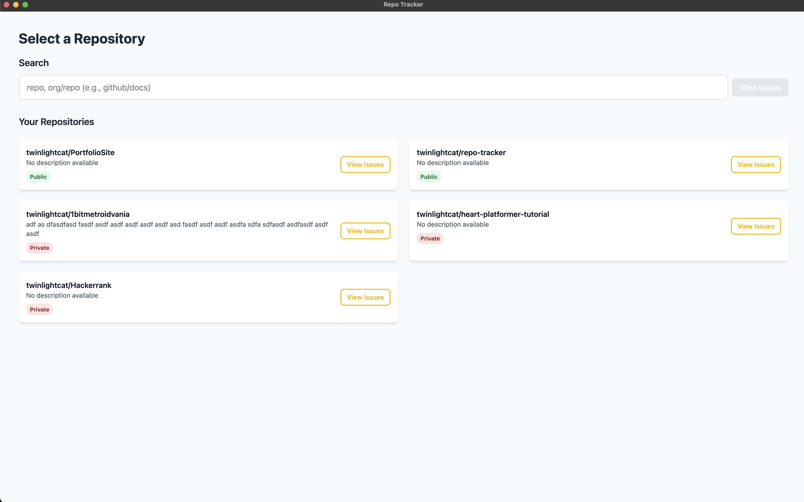

# Repo Tracker

Repo Tracker is a desktop application for browsing GitHub repositories and their issues. Built with Electron, React, and Vite, it provides a clean interface for quickly searching repositories and seeing issues.

## Features

- **Repository Search:** Quickly search for repositories by name or organization.
- **Repository List:** View your own repositories
- **Issue Tracking:** Browse issues for any repository, filter by title or creator.
- **Pagination:** Easily navigate through large lists of issues with pagination controls.
- **Authentication:** Uses GitHub Personal Access Token (PAT) for secure API access (see setup below).

## Screenshots

### Repository Selection



### Issue Browser


## Getting Started

### Prerequisites
- [Node.js](https://nodejs.org/) (v18 or higher recommended)

### Installation

1. **Clone the repository:**
   ```bash
   git clone https://github.com/twinlightcat/repo-tracker.git
   cd repo-tracker
   ```
2. **Install dependencies:**
   ```bash
   npm install
   ```
3. **Set up your GitHub Personal Access Token (PAT):**
   - On bootup the application will ask for the PAT
       - NOTE: Currently is session based, so will need to re-enter on app open 
   - To setup https://github.com/settings/personal-access-tokens
        - The PAT should have **All repositories** with **Issues** at a `read-only` scope for full functionality.

### Running the App

To start the Electron app in development mode:
```bash
npm run start
```

The app will launch in a new window.

## Usage

- **Search for repositories** using the search bar at the top.
- **View your repositories** listed under "Your Repositories" with visibility badges.
- **Click "View Issues"** to browse issues for a repository.
- **Filter issues** by title or creator, and use pagination to navigate.

## Project Structure

```
repo-tracker/
├── src/
│   ├── main/           # Electron main process
│   ├── preload.ts      # Electron preload script
│   ├── types/          # TypeScript types    
│   └── renderer/       # React renderer process
│       ├── components/ # UI components (APIs, content, hooks)
│       ├── pages/      # Page components (home, issues)
│       └── ...
├── package.json
├── vite.*.config.mts   # Vite configs for Electron
├── forge.config.ts     # Electron Forge config
├── README.md
└── ...
```

## Technologies Used
- **Electron** for cross-platform desktop app
- **React** for UI
- **Vite** for development and building
- **TypeScript** for type safety
- **GitHub REST API** for getting the data


## License

MIT License. See [LICENSE](LICENSE) for details.

---

*Repo Tracker is not affiliated with GitHub. All trademarks and copyrights belong to their respective owners.*

